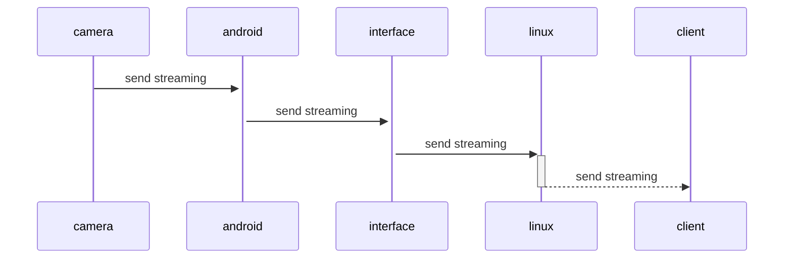

# architehceture

## resources

* Android
* Linux
* USB cable
* [CameraX video capturing architecture](https://developer.android.com/training/camerax/video-capture)

```mermaid
sequenceDiagram
    camera->>+android: send streaming
    android->>+interface: send streaming
    interface->>+linux: send streaming
    linux-->>-client: send streaming
```